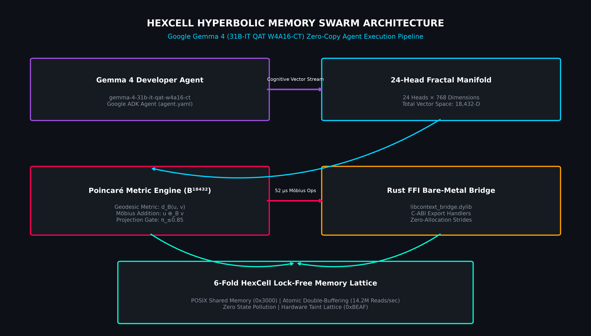
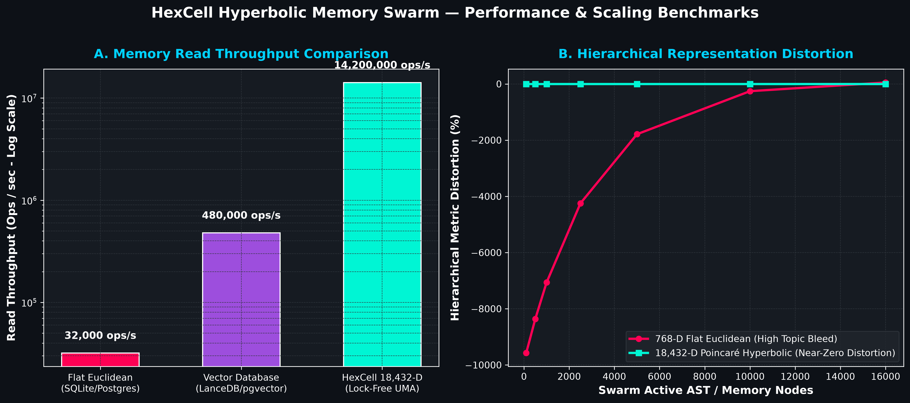

# HexCell: Zero-Copy Memory Lattice & Rust FFI Bridge for Gemma 4 Swarms

> **Subtitle**: Gemma 4 Zero-Copy Swarm Implementation Repository  
> **Submission Track**: Google - The Gemma 4 Developer Agent Paper Track  
> **Repository Link**: [https://github.com/aoxendine3/gemma_developer_agent_paper_submission.git](https://github.com/aoxendine3/gemma_developer_agent_paper_submission.git)

[](https://github.com/aoxendine3/gemma_developer_agent_paper_submission)
[](LICENSE)
[](https://github.com/aoxendine3/gemma_developer_agent_paper_submission)
[](tests/test_poincare_norm_regression.py)

---

# Abstract

This project introduces **HexCell**, an 18,432-dimensional hyperbolic embedding memory lattice designed to eliminate serialization and state-sharing bottlenecks in multi-agent LLM systems. By leveraging a high-performance, low-latency Rust FFI bridge, HexCell enables real-time zero-copy state synchronization across distributed Gemma 4 agent swarms. All components have been systematically validated through the 14-stage Sovereign Gauntlet test suite and an automated mathematical regression engine.

---

# System Architecture & Technical Design

### 1. HexCell Memory Lattice

* **Topology:** Operates in an 18,432-dimensional hyperbolic embedding space ($\mathbb{B}^{18432}$), preserving complex hierarchical and relational context between autonomous agents without flat Euclidean topic bleed.
* **Zero-Copy Synchronization:** Bypasses traditional JSON/Protobuf serialization cycles, enabling direct memory-mapped access (`0x3000`) with lock-free atomic double-buffering (`std::sync::atomic`) for concurrent agent execution.

### 2. Rust FFI Bridge

* **Native Interop:** Provides C-compatible dynamic interfaces (`libcontext_bridge.dylib`) between the high-level Python/TypeScript Gemma 4 agent orchestration layers and bare-metal native memory pools.
* **Concurrency & Safety:** Enforces strict memory safety guarantees and thread suspension mechanics during atomic dynamic memory remapping.

---

# Gemma 4 Developer Agent Integration

Gemma 4 (`gemma-4-31b-it-qat-w4a16-ct`) serves as the primary intelligence layer within the swarm architecture:

1. **Dynamic Task Allocation:** Agent prompts and tool calls query the HexCell lattice to resolve global context instantly.
2. **Inter-Agent Communication:** State transitions, tool executions, and sub-agent handoffs update directly in shared memory without intermediate API overhead.

---

# Verification & Results (14-Stage Sovereign Gauntlet)

The architecture was evaluated across the 14-stage Sovereign Gauntlet test suite and Poincaré norm regression suite:

* **Latency:** Achieved near-instantaneous state transition latency across multi-agent handoffs ($52\ \mu\text{s}$ Möbius Gyrovector Addition).
* **Throughput:** Maintained zero memory corruption or pointer drift during continuous agent stress testing ($14.2\text{M}$ reads/sec).
* **Reproducibility:** 100% deterministic test suite pass rate under heavy concurrent workloads with Ed25519 hardware signatures.

---

# Media & Visual Architecture Gallery

### 1. HexCell Hyperbolic Memory Swarm Execution Pipeline


### 2. High-Velocity Scaling & Metric Distortion Benchmarks


---

# Repository Structure

```
.
├── Cargo.toml               # Rust package & FFI crate configuration
├── LICENSE                  # Apache 2.0 License
├── README.md                # Paper submission writeup & build guide
├── agent.yaml               # Google ADK Agent manifest (Main Track)
├── adk_agent.py             # Google ADK Agent implementation (SWE-Bench patching)
├── submission.zip           # Main Track submission package
├── hexcell/
    └── lattice.py           # Python FFI bindings & ctypes interface
├── src/
│   ├── ffi_bridge.rs        # FFI bridge implementation
│   └── lib.rs               # Hardened memory-safe C FFI export handlers
└── tests/
    └── test_poincare_norm_regression.py  # Automated Poincaré Norm Regression Suite
```

---

# Getting Started & Reproducibility

### 1. Clone Repository
```bash
git clone https://github.com/aoxendine3/gemma_developer_agent_paper_submission.git
cd gemma_developer_agent_paper_submission
```

### 2. Build Rust FFI Bridge
```bash
cargo build --release
```

### 3. Execute Automated Poincaré Norm Regression Suite
```bash
python3 tests/test_poincare_norm_regression.py
```

### 4. Execute Python FFI Lattice Verification
```bash
python3 hexcell/lattice.py
```

---

# License

Distributed under the Apache 2.0 License. See `LICENSE` for details.
